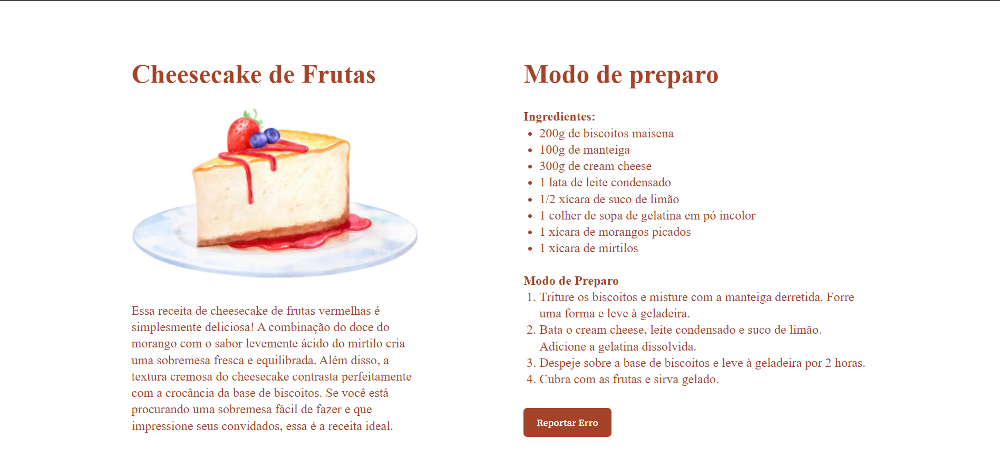

## 💻 Projeto

# Cheesecake
 Esse projeto responsivo de página de receita de um delicioso Cheesecake é desenvolvido no nível 03 do Explorer, o programa completo da Rocketseat que te leva do zero até sua primeira vaga como dev.

 

  
  

  ## 📝 Licença

Esse projeto está sob a licença MIT. Veja o arquivo [LICENSE](LICENSE) para mais detalhes.
